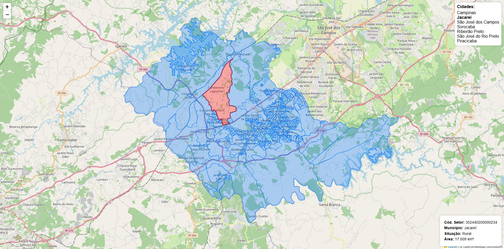

# Atividade 8 - Visualização de Dados Espaciais
**Disciplina:** Desenvolvimento Web II  
**Data:** 10/06/2025

## Objetivo
Esta aplicação web permite visualizar os setores censitários do Censo Demográfico 2022 para municípios do Estado de São Paulo utilizando um mapa interativo com dados geográficos em formato GeoJSON.




## Funcionalidades Implementadas
- Exibição do mapa em tela cheia com Leaflet;
- Lista de municípios exibida no canto superior direito;
- Troca de município com centralização automática do mapa;
- Exibição dos setores censitários como polígonos carregados da API;
- Detalhes do setor censitário ao clicar em um polígono;
- Código modular com React Context API, Styled Components, e separação de serviços HTTP.

## Municípios Disponíveis
- Campinas;
- Jacareí (inicialmente carregado);
- São José dos Campos;
- Sorocaba;
- Ribeirão Preto;
- São José do Rio Preto;
- Piracicaba.

## Tecnologias Utilizadas
- React com TypeScript;
- React Context API para gerenciamento de estado;
- Styled Components para estilização;
- Leaflet e React-Leaflet para visualização de mapas;
- Axios para requisições HTTP.

## Estrutura do Projeto
```
atividade/
├── frontend/
│   ├── src/
│   │   ├── api/
│   │   │   └── censoService.ts
│   │   ├── components/
│   │   │   ├── CidadeSelector.tsx
│   │   │   ├── InfoBox.tsx
│   │   │   └── Mapa.tsx       
│   │   ├── context/
│   │   │   └── CensoContext.tsx          
│   │   ├── styles/
│   │   │   └── GlobalStyle.ts           
│   │   ├── App.tsx           
│   │   ├── main.tsx          
│   │   └── index.css         
│   ├── package.json          
│   └── vite.config.ts        
├── server/
│   ├── data/
│   │   ├── censo_2022_campinas.geojson
│   │   ├── censo_2022_jacarei.geojson
│   │   ├── censo_2022_jacarei.qmd
│   │   ├── censo_2022_piracicaba.geojson
│   │   ├── censo_2022_ribeirao_preto.geojson
│   │   ├── censo_2022_sao_jose_do_rio_preto.geojson
│   │   ├── censo_2022_sao_jose_dos_campos.geojson
│   │   ├── censo_2022_sorocaba.geojson
│   │   └── comandos.sql 
│   ├── src/
│   │   ├── controllers/
│   │   │   ├── CensoController.ts
│   │   │   ├── db.ts
│   │   │   └── load.ts
│   │   ├── routes/
│   │   │   ├── censo.ts
│   │   │   └── index.ts
│   │   └── index.ts  
│   ├── package.json    
│   ├── package-lock.json
│   ├── .env
│   └── tsconfig.json
└── README.md
```

## Instalação e Execução
1. Clonar o repositório
```bash
git clone https://github.com/GabrielFrois/setores-censitarios.git atividade
```

2. Configurar o banco de dados:
- Crie um banco de dados PostgreSQL
- Instale a extensão PostGIS
- No pgAdmin ou outro client SQL, copie os comandos do arquivo `data/comandos.sql` e cole para executar os comando para criar as tabelas no banco de dados
- Edite o arquivo .env dentro de `server/` com os dados de sua conexão
- Carregue os dados no banco com:
```bash
cd server
npm install
npm run load
```

3. Executar o backend:
```bash
npm run dev
```
O backend estará disponível em: `http://localhost:3001`  

4. Executar o frontend:
```bash
cd frontend
npm install
npm run dev
```
O frontend estará disponível em: `http://localhost:5173`

## Endpoints da API
### `GET /censo?city=name`
Lista todos os setores censitários de uma cidade armazenados no banco de dados.

### `GET /censo/point?y=<latitude>&x=<longitude>`
Consulta o setor censitário que contém o ponto geográfico fornecido.  

**Exemplo de requisição:**
```
http://localhost:3001/censo/point?y=-23.354557&x=-45.955810
```

**Exemplo de resposta:**
```json
{
  "cd_setor": "352440205000236",
  "situacao": "Rural",
  "area_km2": 44.9009403805158,
  "nm_mun": "Jacareí",
  "geom": "MULTIPOLYGON(...)"
}
```
